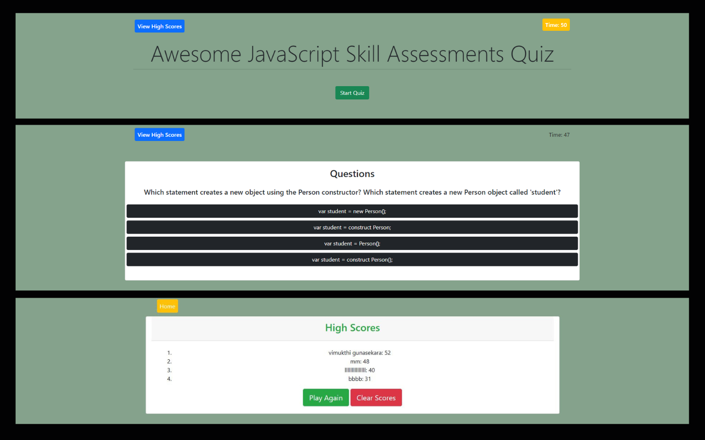

# Code Quiz Game
        
## 🌟[Description](#table-of-contents)
Make a quiz game that runs for a set amount of time. Includes a section with top scores and times. Keeping track of high scores is saved locally.

    
    
    
    
    
    
    

## Table-of-Contents
* [Description](#description)
* [Submission](#User-Stor)
* [Mock-Up](#Mock-Up)
* [License](#License)
* [Contributing](#contributing)
* [FAQs](#faqs)
  
## 🚀 [Submission](#table-of-contents)

Deployed app : https://vimukthigunasekara.github.io/code-quiz/
 
Github Page : https://github.com/VimukthiGunasekara/code-quiz

## 📺 [Mock-Up](#table-of-contents)

      
## 📑 [License](#table-of-contents)

Your repository is licensed under an mit open source license, so other people can contribute more easily.More information can be found by clicking this [link.](https://choosealicense.com/licenses/mit)

## 🤝 [Contributing](#table-of-contents)
We are open to all kinds of contributions. If you want to:
* 🤔 Suggest a feature
* 🐛 Report an issue
* 📖 Improve documentation
* 👨‍💻 Contribute to the code

We are excited that you are reading this and are willing to contribute. No need to think big. Even a typo fix might save our day and make you a hero. Every contribution counts!
     
Feel free to check [issues page](https://github.com/VimukthiGunasekara/code-quiz/issues) 
     
## 🤔 [FAQs](#table-of-contents)
Please contact me using the following links :
[Vimukthi Gunasekara](https://github.com/VimukthiGunasekara)

